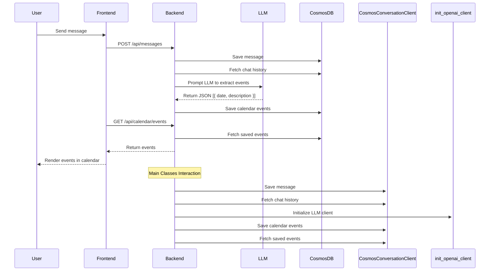

```mermaid
sequenceDiagram
    participant User
    participant Frontend
    participant Backend
    participant LLM
    participant CosmosDB

    User->>Frontend: Send message
    Frontend->>Backend: POST /api/messages
    Backend->>CosmosDB: Save message
    Backend->>CosmosDB: Fetch chat history
    Backend->>LLM: Prompt LLM to extract events
    LLM-->>Backend: Return JSON [{ date, description }]
    Backend->>CosmosDB: Save calendar events
    Frontend->>Backend: GET /api/calendar/events
    Backend->>CosmosDB: Fetch saved events
    Backend-->>Frontend: Return events
    Frontend-->>User: Render events in calendar

    note over Backend: Main Classes Interaction
    Backend->>+CosmosConversationClient: Save message
    Backend->>+CosmosConversationClient: Fetch chat history
    Backend->>+init_openai_client: Initialize LLM client
    Backend->>+CosmosConversationClient: Save calendar events
    Backend->>+CosmosConversationClient: Fetch saved events
```